

# 🍕 FoodReel Short-Video Food Discovery & Real-Time Ordering App

An interactive full-stack food discovery platform inspired by **Instagram/TikTok Reels** and **Food Delivery Platforms**. Customers explore dishes through full-screen video reels, customize portion sizes, and order directly from local restaurant partners.

 

---

## App Showcase & Feature Gallery

---

### 1. Video Reels Feed & Instant Search
Full-screen auto-playing reels with double-tap like (`❤️`), bookmarking (`🔖`), sound toggle, restaurant brand badge, glowing price tags, and a floating glassmorphic search bar.

| 🎬 Full-Screen Video Reel Feed | 🔍 Instant Dish Search Filter |
| :---: | :---: |
| 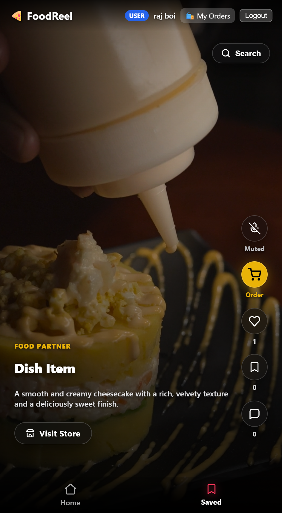 | 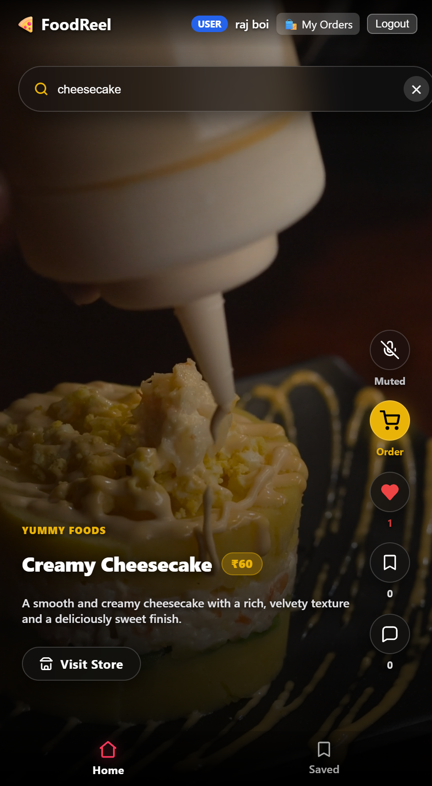 |

| ❤️ Double-Tap Like & Bookmark | 🏪 Restaurant Profile View |
| :---: | :---: |
| 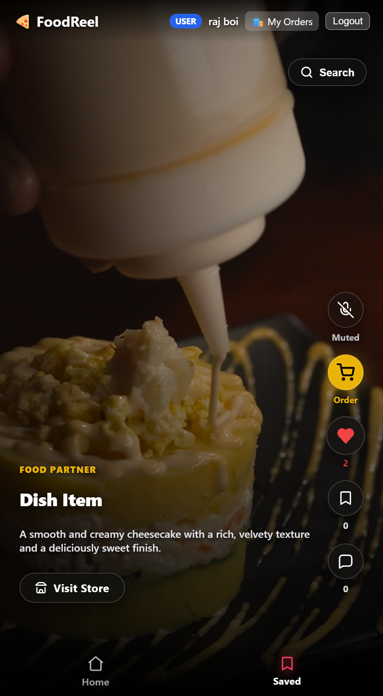 | 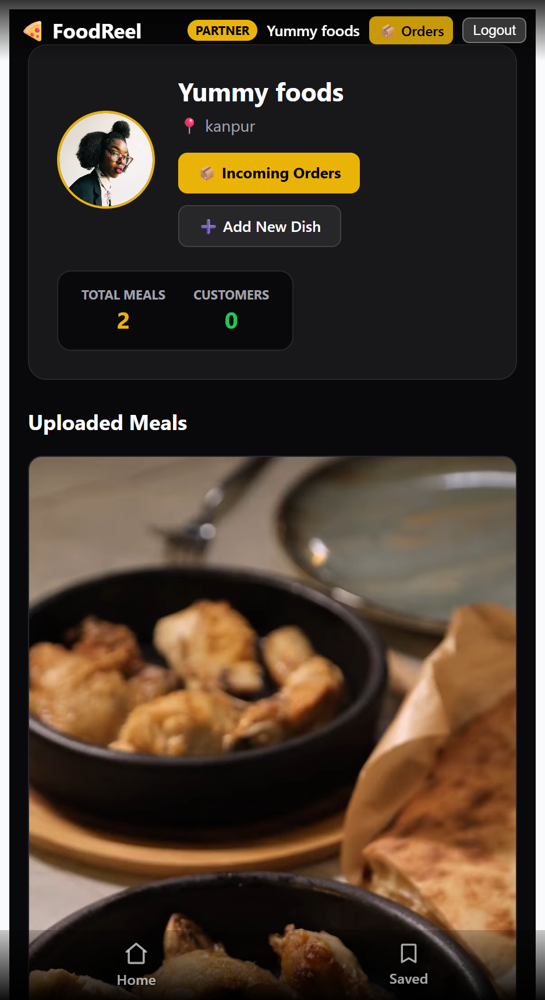 |

---

### 2. Smart Ordering & Dynamic Portion Customization
Customers customize portion sizes (**Small**, **Medium**, **Large**, **Full**) with real-time price calculation and interactive `+ / -` quantity stepper controls.

| 🥞 Custom Quantity Stepper | 🥟 Small Portion Size Order |
| :---: | :---: |
| 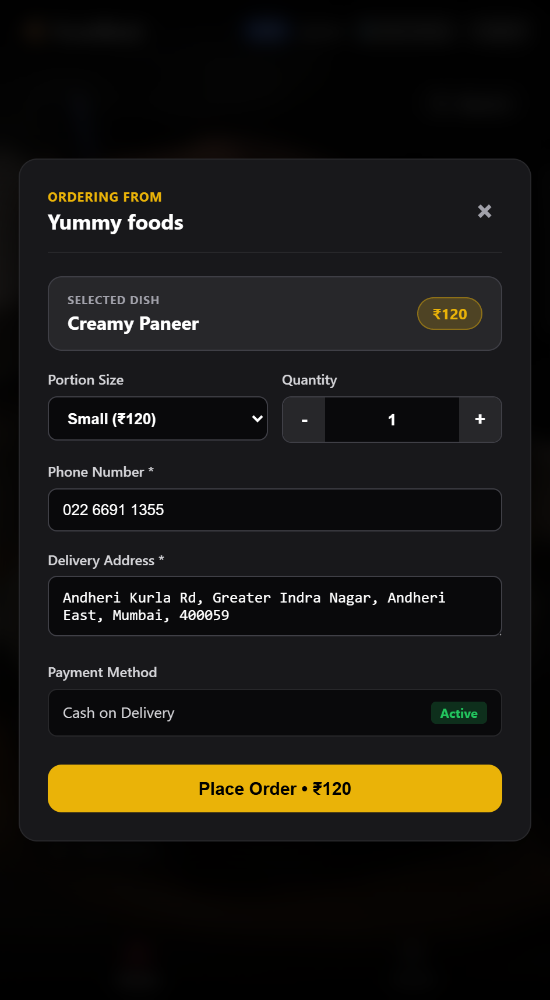 | 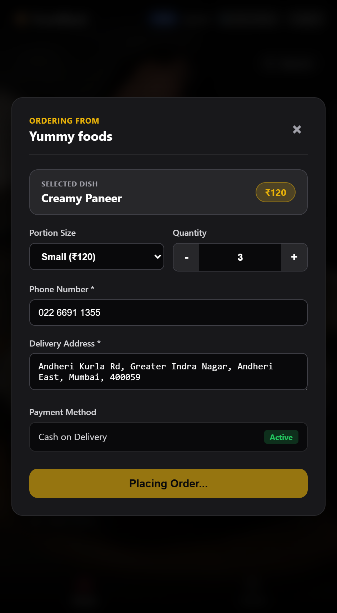 |

---

### 3. Customer & Partner Order Management
Real-time tracking of order statuses (**Pending** ➡️ **Accepted** ➡️ **Completed** / **Rejected**) with instant delete/cancellation controls.

| Customer "My Orders" Dashboard | 📦 Incoming Restaurant Orders |
| :---: | :---: |
| 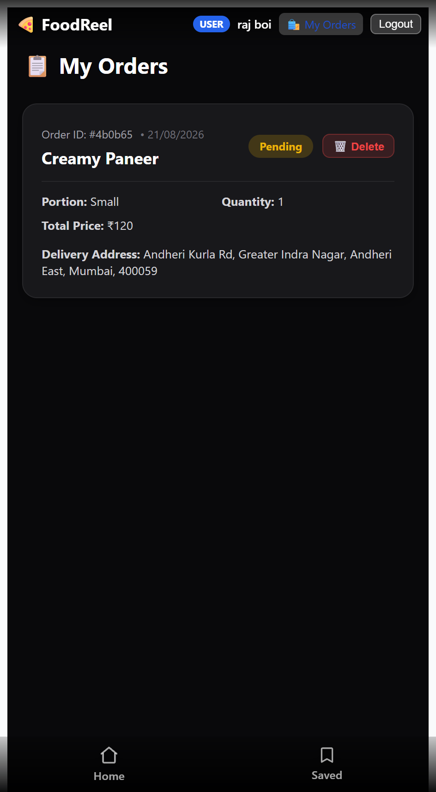 | 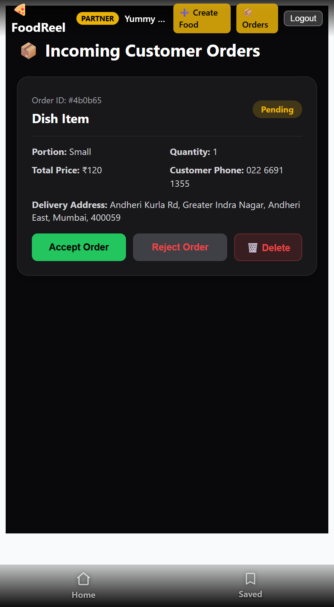 |

---

### 4. Interactive Community & Comments
Slide-up reviews sheet allowing customers to share reviews, read feedback on dishes, and manage comments.

| 💬 Community Comments List | ✍️ Empty Comments State |
| :---: | :---: |
| 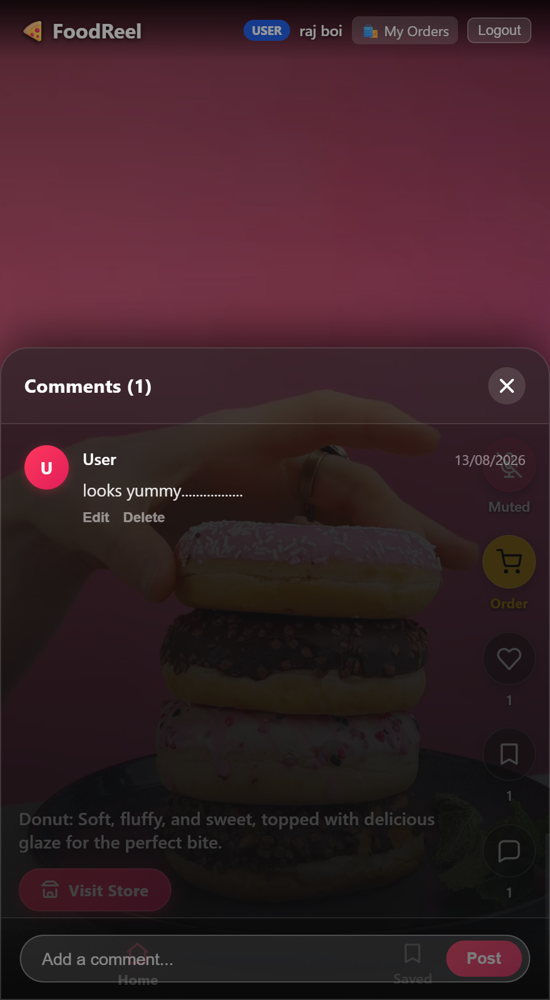 | 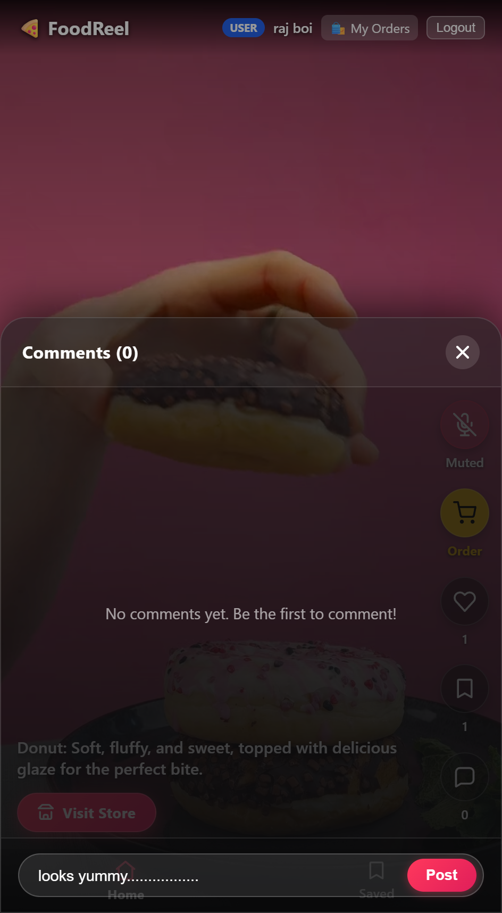 |

---

### 5. Food Partner Portal & Dish Creation
Restaurant partners upload food video reels directly to cloud storage and configure custom portion pricing.

| ➕ Create Food & Portion Pricing | 📹 Video Upload Preview |
| :---: | :---: |
| 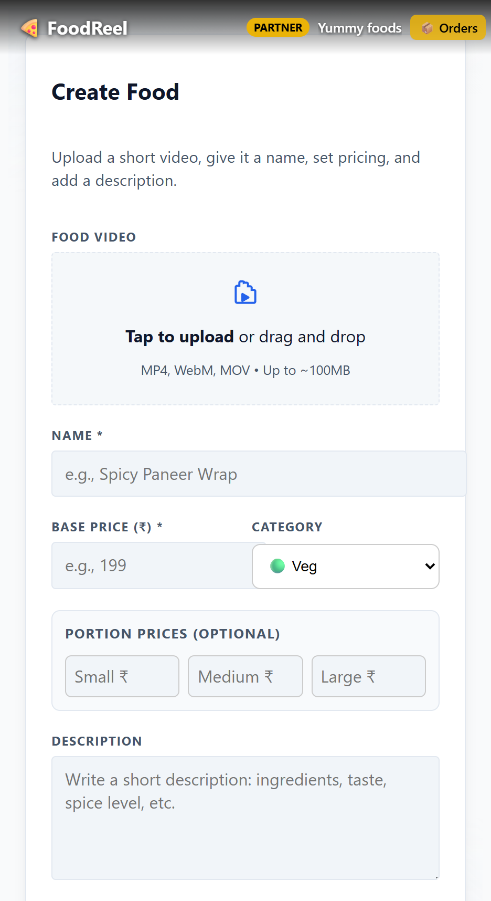 | 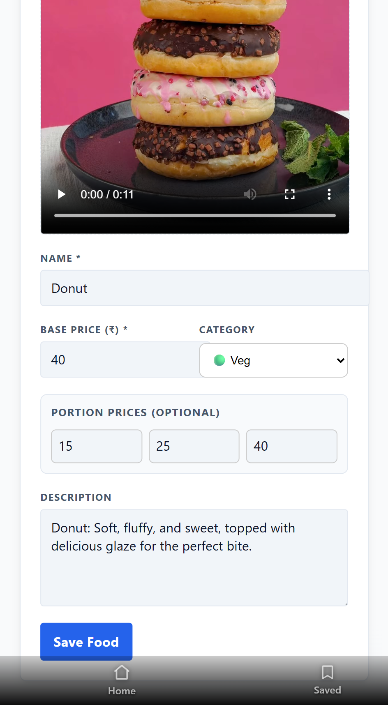 |

---

### 🔐 6. Authentication & User Onboarding
Dedicated sign-in and registration workflows tailored for both **Customers** and **Food Partners**.

| 👤 Customer Login | 📝 Customer Registration |
| :---: | :---: |
| 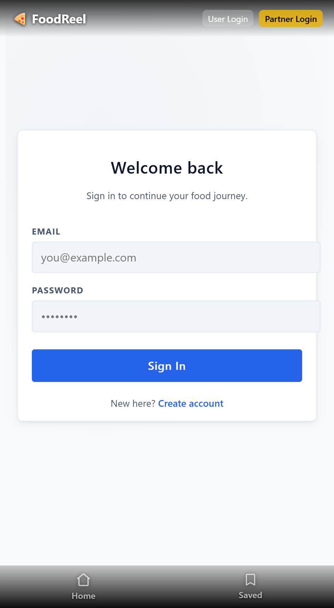 | 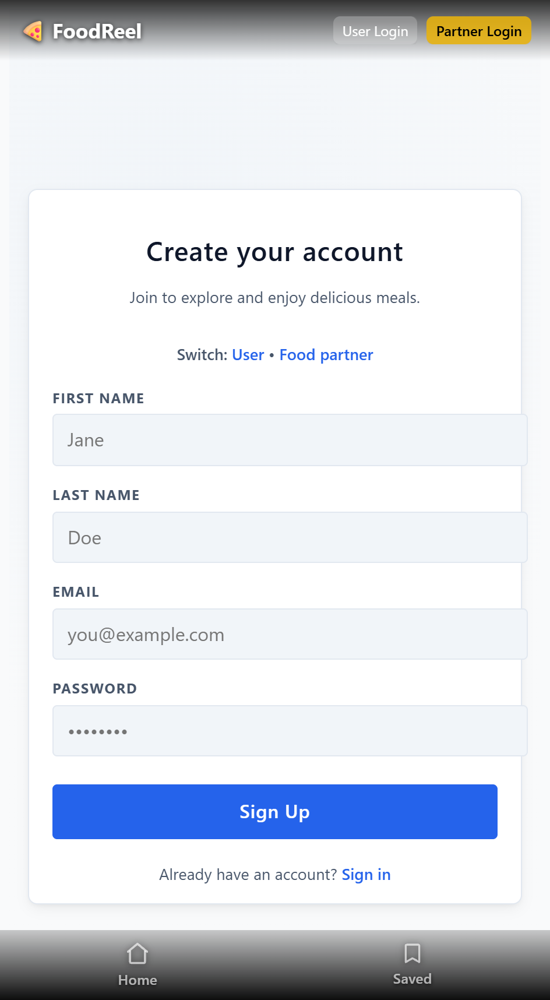 |

| 🏪 Partner Login | 📝 Partner Registration |
| :---: | :---: |
| 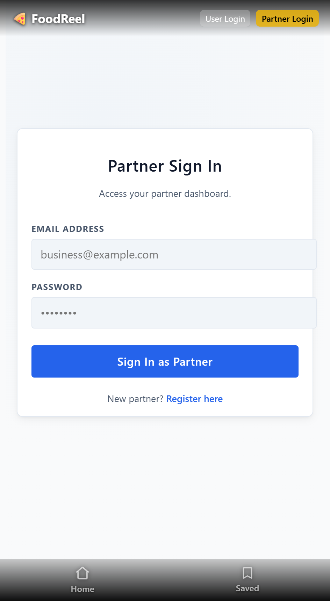 | 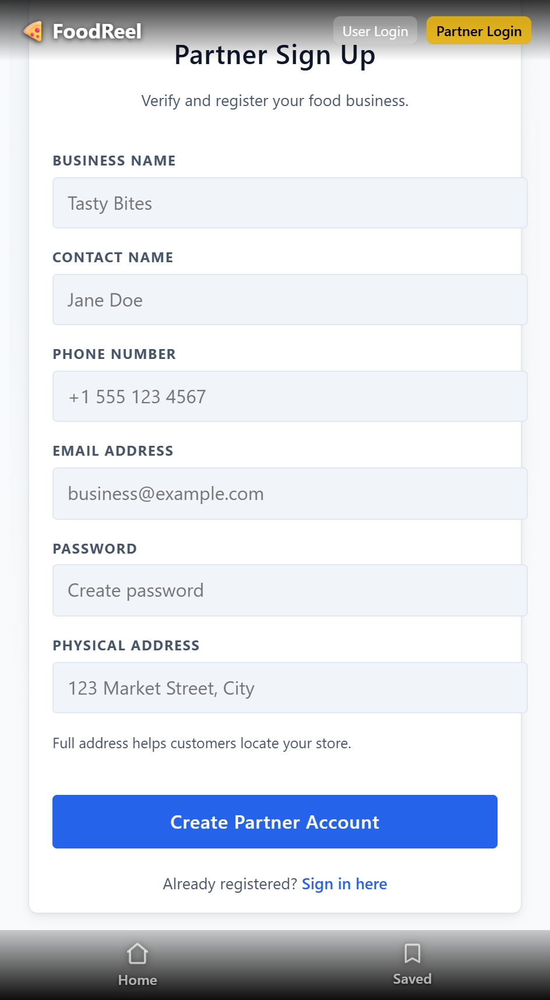 |

---

## 🛠️ Tech Stack & Architecture

### **Frontend**
- **React 18 & Vite:** Lightning-fast UI development with component-based architecture.
- **React Router v6:** Client-side routing with protected partner/user views.
- **Axios:** API client with cross-origin credentials and Bearer token headers.
- **Modern CSS3 & Glassmorphism:** Spring physics animations (`@keyframes`), backdrop filters, and responsive mobile-first design.

### **Backend**
- **Node.js & Express.js:** RESTful API architecture with structured controllers, routes, and middleware.
- **MongoDB Atlas & Mongoose:** Schema modeling with dynamic subdocuments, population, and indexing.
- **JWT & Bcrypt:** Secure token-based authentication with password hashing.
- **Multer:** Multipart memory buffer handling for seamless video uploads.

### **Cloud Storage**
- **Supabase Storage:** Direct object storage for streaming high-definition `.mp4` video files with public CDN delivery.

---

## 📂 Project Structure

foodreelwithorder/
├── backend/
│   ├── src/
│   │   ├── controllers/
│   │   │   ├── auth.controller.js           # Handles User & Partner Authentication
│   │   │   ├── food-partner.controller.js   # Food Partner Profile & Analytics
│   │   │   └── food.controller.js           # Video Reels, Likes, Saves & Comments Logic
│   │   ├── db/
│   │   │   └── db.js                        # MongoDB Atlas Connection
│   │   ├── middlewares/
│   │   │   └── auth.middleware.js           # JWT Verification & Role-Based Auth Guards
│   │   ├── models/
│   │   │   ├── comment.model.js             # User Reviews & Comments Schema
│   │   │   ├── food.model.js                # Video Dishes & Portion Prices (Small/Med/Large)
│   │   │   ├── foodpartner.model.js         # Restaurant Partner Schema (Name, Address, Phone)
│   │   │   ├── likes.model.js               # Likes Tracker Schema
│   │   │   ├── order.model.js               # Customer Orders & Status Schema
│   │   │   ├── save.model.js                # Saved/Bookmarked Dishes Schema
│   │   │   └── user.model.js                # Customer Account Schema
│   │   ├── routes/
│   │   │   ├── auth.routes.js               # /api/auth Endpoints (Login/Register)
│   │   │   ├── food-partner.routes.js       # /api/food-partner Endpoints (Profile/Details)
│   │   │   ├── food.routes.js               # /api/food Endpoints (Reels Feed, Like, Save, Comment)
│   │   │   └── order.routes.js              # /api/orders Endpoints (Create, Partner/User Orders, Status)
│   │   ├── services/
│   │   │   └── storage.service.js           # Supabase Cloud Storage (Public Video CDN)
│   │   └── app.js                           # Express App Configuration & Middlewares
│   ├── .env                                 # Backend Environment Variables
│   ├── .env.example                         # Environment Variables Template
│   ├── package-lock.json
│   ├── package.json
│   └── server.js                            # Server Entrypoint (Listens on Port)
│
├── frontend/
│   ├── public/                              # Static Icons & Web Assets
│   ├── src/
│   │   ├── assets/                          # App Media & Assets
│   │   ├── components/
│   │   │   ├── BottomNav.jsx                # Mobile Bottom Navigation Bar (Home & Saved)
│   │   │   ├── CommentModal.jsx             # Slide-Up Comments & Reviews Modal
│   │   │   ├── Navbar.jsx                   # Top Header Navbar with Dynamic Role Actions
│   │   │   ├── OrderModal.jsx               # Custom Portion Sizing & Quantity Stepper Modal
│   │   │   └── ReelFeed.jsx                 # Full-Screen Video Player with Search & Micro-Interactions
│   │   ├── pages/
│   │   │   ├── auth/
│   │   │   │   ├── ChooseRegister.jsx       # Role Selection (Customer vs Restaurant Partner)
│   │   │   │   ├── FoodPartnerLogin.jsx     # Food Partner Sign-In
│   │   │   │   ├── FoodPartnerRegister.jsx  # Food Partner Registration
│   │   │   │   ├── UserLogin.jsx            # Customer Sign-In
│   │   │   │   └── UserRegister.jsx         # Customer Registration
│   │   │   ├── food-partner/
│   │   │   │   ├── CreateFood.jsx           # Dish Creation with Dynamic Portion Pricing
│   │   │   │   ├── PartnerOrders.jsx        # Partner Dashboard for Incoming Customer Orders
│   │   │   │   └── Profile.jsx              # Restaurant Profile & Menu Management
│   │   │   └── general/
│   │   │       ├── Home.jsx                 # Home Video Reels Feed
│   │   │       ├── MyOrders.jsx             # Customer Order Tracking & History
│   │   │       └── Saved.jsx                # Bookmarked Video Dishes Collection
│   │   ├── routes/
│   │   │   └── AppRoutes.jsx                # React Router v6 Configuration
│   │   ├── styles/                          # Component & Page Stylesheets
│   │   ├── App.css                          # Global Resets & Keyframe Animations
│   │   ├── App.jsx                          # Root Application Component
│   │   └── main.jsx                         # React 18 DOM Entrypoint
│   ├── .env                                 # Frontend Environment Variables
│   ├── .gitignore
│   ├── eslint.config.js                     # ESLint Configuration
│   ├── index.html                           # Single Page HTML Template
│   ├── package-lock.json
│   ├── package.json
│   └── vite.config.js                       # Vite Bundler Configuration
│
├── Photos/                                  # UI Showcase Screenshots (1.png - 16.png)
├── LICENSE                                  # MIT License
└── README.md                                # Project Documentation

---

## 📄 License

This project is licensed under the [MIT License](LICENSE) — feel free to use, modify, and build upon this code for personal or commercial projects.

Copyright (c) 2026 Bindheyashrita Pradhan

